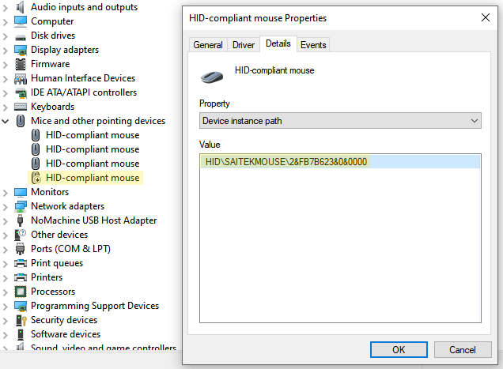

# X52 PRO Mouse Ministick to Axes
A simple registry hack to map the mouse ministick of the X52 PRO to usable axes. Instead of having an X/Y mouse movement, you can make it work as independent axes which can be pretty useful for slew functions in flying simulators (e.g. Throttle Designator Controller (TDC) in a F/A-18C Hornet).

## Limitation & Implication
The X52 PRO is using a total of 7 physical axes and the protocol used with the device permits a total of 8 axes. This implies that we only have one free axis for the X/Y mouse ministick movement. 

A way to work around this is to sacrifice a physical axis. A good candidate for this in the RZ axis which is the twist movement of the stick. The RZ axis is usally meant for rudder control, but this axis isn't used anymore when using rudder pedals.

## Final result
By applying this registry hack, the X movement of the ministick will be mapped to RZ (twist movement of the stick) and the Y movement of the ministick will be mapped to SLIDER2 (second unused slider).

## How to use

### Install

- Download the `src` folder.
- Launch `src/x52pro_ministick_map__X-to-RZ___Y-to-SLIDER2.reg` and apply changes.

#### Disable the X52 PRO mouse driver
If moving the ministick after the registry hack is moving a mouse cursor on your screen, you'll need to disable the driver associated with it.

- Open the Device Manager (WIN+R, type devmgmt.msc then enter)
- Open "Mice and other pointing devices" sub-menu
- Inspect each device to find the mouse associated to your X52 PRO
    - Right click => Properties => Details tab => Look at the property "Device instance path" or "Hardware Ids"
- Disable it
    - Right click => "Disable device"

### Uninstall

- Launch `src/x52pro_ministick_map_UNINSTALL.reg` and apply changes.
- Enable back the X52 PRO mouse driver if you disabled it and need it again.

## Why the Windows joystick viewer doesn't apply the mapping?
The Windows joystick viewer (Game Controller properties, can be opened by typing WIN+R and writing joy.cpl then enter) is using a special implementation which reflects exactly what is physically pressed. However it is biased as the logical mapping used by simulators is not reflected. You can pretty much ignore this window and check directly in your simulator. You can also use another joystick viewer software which is more likely going to show you the logical axes. An example of such a software is the [VKB Joy Tester](https://vkbcontrollers.com/?page_id=4609).

## Special thanks
Thanks to u/Tarvis451 from reddit for sharing his [solution](https://www.reddit.com/r/hotas/comments/2rs6un/how_to_turn_x55_mouse_ministick_into_joystick_axes/) which this project is based on.

## License

Feel free to do whatever you want. The project is released under the [MIT](./LICENSE.md) license.